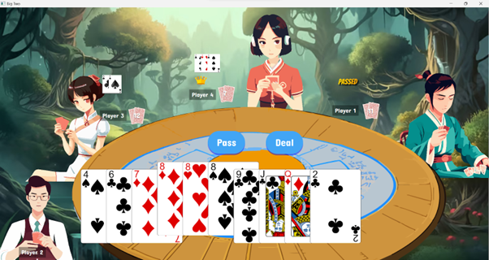

# Big Two Card Game

## Table of Contents

- [Introduction](#introduction)
- [Gameplay](#gameplay)
- [Features](#features)
- [Installation](#installation)
- [How to Play](#how-to-play)
- [Video Links](#video-links)

## Introduction

Welcome to the Big Two Card Game! This is a digital version of the popular card game Big Two, also known as Deuces or Chinese Poker. The game is played with a standard deck of 52 playing cards and is designed for multiple players.

## Gameplay

Big Two is a shedding-type card game where the objective is to get rid of all your cards. Players take turns playing a higher-ranked combination of cards than the previous player's combination. The player who successfully plays all their cards first wins the round.

## Features

- **Multiplayer:** Play with friends.
- **Combo Logic:** Utilize various card combinations like singles, pairs, straights, flushes, and more.
- **Timer:** Timer to transition between players' turns.
- **Leaderboard:** Keep track of high scores and see who's the best Big Two player.
- **Intuitive GUI:** Easy-to-use graphical user interface for a smooth gaming experience.

## Installation

1. Clone the repository: `git clone https://github.com/cheryl-toh/big-two-card-game.git`
2. Navigate to the game's directory
3. Compile and run the game: `sbt run`

## How to Play

1. Launch the game.
2. Cards will be distributed among players.
3. Follow the rules of Big Two to play your cards.
4. The player who gets rid of all their cards first wins the round.
4. Submit a pull request detailing your changes.

## Video Links
Presentation Video:
`https://youtu.be/eNxJDV72YkQ`

Full Game Play Recording:
`https://www.youtube.com/watch?v=d-v1SP657pI`

